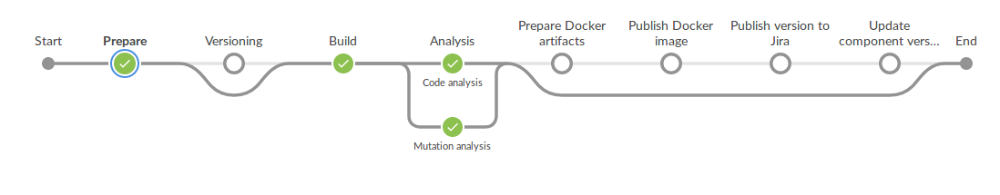
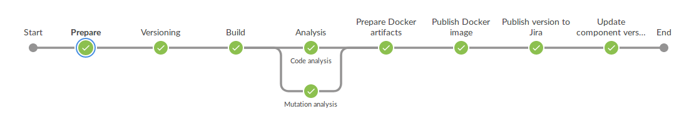
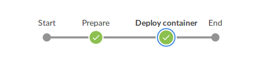

# coding-challenge-route-calculator

This is a Spring Boot REST application.
- Manages security with Spring Security
- Configuration is stored independent in a git repository using Spring Cloud Config
- Active endpoints can be tested with Swagger

The main purpose is to serve city routes given an origin city, the endpoint return a list with possible routes depending on less time or less connections.
Example of data model:
```json
  {
    "cityOrigin": "Zaragoza",
    "cityDestiny": "Madrid",
    "connections": [
      {
        "id": "5c65921e2ab79c000173a686",
        "city": "Zaragoza",
        "cityDestiny": "Madrid",
        "departureTime": "10:00:00",
        "arrivalTime": "11:20:00"
      }
    ],
    "totalConnections": 1,
    "totalTime": 80
  },
  {
    "cityOrigin": "Zaragoza",
    "cityDestiny": "Barcelona",
    "connections": [
      {
        "id": "5c65921e2ab79c000173a686",
        "city": "Zaragoza",
        "cityDestiny": "Madrid",
        "departureTime": "10:00:00",
        "arrivalTime": "11:20:00"
      },
      {
        "id": "5c65921e2ab79c000173a687",
        "city": "Madrid",
        "cityDestiny": "Barcelona",
        "departureTime": "13:20:00",
        "arrivalTime": "19:40:00"
      }
    ],
    "totalConnections": 2,
    "totalTime": 580
  }
]
```

## build & run

**Prerequisites**
- Maven installed
- Docker installed
- [Spring Cloud Config running on docker](#spring-cloud-config-on-docker-how-to)
- Create docker network
```bash
$ docker network create codingchallenge
```

**Steps (Running on docker)**
1. Execute docker run bash script
```bash
$ ./docker-run.sh
```

**Steps (Running natively)**
1. Maven clean package:
```bash
$ mvn -f ./pom.xml clean package
```
2. JAR run:
```bash
$ java "-Dserver.port=8070" "-Dspring.cloud.config.uri=http://localhost:8888" "-Djava.security.egd=file:/dev/./urandom" \
    -jar target/coding-challenge-route-calculator-0.0.1-SNAPSHOT.jar
```

## swagger

Swagger UI: http://localhost:8070/swagger-ui.html

## spring security

**Users:**

- user/userPass
- admin/adminPass

## spring cloud config on docker (how to)

**Against remote git repository**
```bash
$ docker run -d -p 8888:8888 \
    --net codingchallenge \
    --name spring-cloud-config \
    -e SPRING_CLOUD_CONFIG_SERVER_GIT_URI=<uri> \
    -e SPRING_CLOUD_CONFIG_SERVER_GIT_USERNAME=<user> \
    -e SPRING_CLOUD_CONFIG_SERVER_GIT_PASSWORD=<password> \
    -e SPRING_CLOUD_CONFIG_SERVER_GIT_CLONE_ON_START=true \
    hyness/spring-cloud-config-server:2.1.0.RELEASE
```
**Against local git repository**
```bash
$ docker run -d -p 8888:8888 \
    --net codingchallenge \
    --name spring-cloud-config \
    -v /path/to/config/files/dir:/config \
    -e SPRING_PROFILES_ACTIVE=native \
    hyness/spring-cloud-config-server:2.1.0.RELEASE
```

## mongodb on docker (how to)

```bash
$ docker run -d -p 27017:27017 \
    --net codingchallenge \
    --name mongodb1 \
    -v /path/to/config/mongodb-datadir:/data/db \
    mongo:4.0
```

## proposed CI/CD pipeline

CI/CD Pipeline tool should be Jenkins configured by Jenkinsfile and using Multibranch Pipeline Jobs

Common repositories:
- version-tracker:
  - git repository with version files of all the microservices deployed
  - one branch per environment (dev, int, pro)

**Feature branch strategy**

Feature branches just build the project and execute tests to check the branch is correct.



**Master branch strategy**

Master branch execute .the whole CI/CD pipeline to prepare the project to deploy to the environment.



- _Versioning_: generate project version
- _Prepare Docker artifacts_: build docker image
- _Publish Docker image_: publish docker image to a docker artifactory
- _Publish version to Jira_: integrate with Jira issue to track the project version
- _Update component version_: update version in version-tracker repository

**Deployment strategy**



- _Deploy container_: deploy container in environment (defined by brach name)

### common stages

- _Prepare_: prepare needed libraries for execute the pipeline
- _Build_: build project
- _Analysis_: execute project tests (unit tests, mutation tests, integration tests...)
